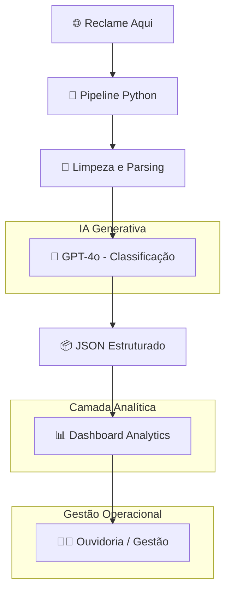

# Ouvidoria Analytics – Bradesco

# Dashboard Inteligente para Gestão de Reclamações

Sistema inteligente de classificação automática de reclamações do Reclame Aqui com direcionamento operacional, análise de SLA e prescrição automatizada de ações corretivas.

---

# Visão Geral

O projeto **Ouvidoria Analytics – Bradesco** foi desenvolvido para transformar reclamações públicas em inteligência operacional acionável para a área de Ouvidoria.

A solução utiliza IA Generativa (GPT-4o) para:

- Classificar reclamações automaticamente
- Identificar áreas responsáveis
- Definir urgência operacional
- Prescrever ações corretivas
- Monitorar SLA
- Detectar recorrência de problemas
- Gerar analytics gerenciais

---

# Arquitetura da Solução



---

# 🔄 Fluxo Operacional Completo


---

# Funcionalidades do Dashboard

| Módulo | Descrição |
|---|---|
| KPIs Operacionais | Reclamações, SLA e urgência |
| Evolução Temporal | Tendência semanal |
| SLA por Categoria | Tempo médio sem resposta |
| Problemas Recorrentes | Principais causas raiz |
| Áreas Responsáveis | Volume por diretoria |
| Exportação CSV | Download dos dados filtrados |
| Monitoramento IA | Confiança e revisão humana |

---

# Pipeline de IA

## Modelo utilizado

- GPT-4o via API OpenAI

## Estratégias aplicadas

- Prompt Engineering
- Few-shot Learning
- Saída JSON estruturada
- Taxonomia personalizada
- Controle de confiança

---

# 📁 Estrutura do Repositório

```text
 dashboard-ouvidoria
│
├── dashboard/
│   └── ouvidoria_dashboard.html
│
├── data/
│   └── reports/
│       └── dashboard_data.json
│
├── scripts/
│   └── pipeline_classificacao.py
│
└── README.md
```

---

# 🚀 Como Executar

```bash
git clone https://github.com/daniell-santana/dashboard-ouvidoria.git
cd dashboard-ouvidoria
```

Abrir:

```text
dashboard/ouvidoria_dashboard.html
```

---

# Resultados Obtidos

| Métrica | Resultado |
|---|---|
| Reclamações coletadas | 251 |
| Confiança média da IA | 89,2% |
| Alta urgência | 118 casos |
| Revisão humana | 3 casos |
| Categorias mapeadas | 7 |

---

# Stack Tecnológica

| Camada | Tecnologia |
|---|---|
| Scraping | Python + Requests + BeautifulSoup |
| Processamento | Pandas |
| IA Generativa | GPT-4o |
| Dashboard | HTML + CSS + JS |
| Visualização | Chart.js |
| Hospedagem | GitHub Pages |

---

# Autor

Daniel Santana

Projeto demonstrativo de IA aplicada à experiência do cliente e analytics operacional
